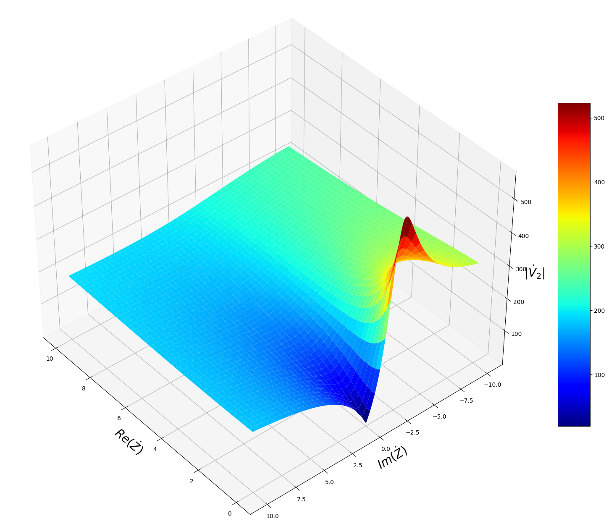
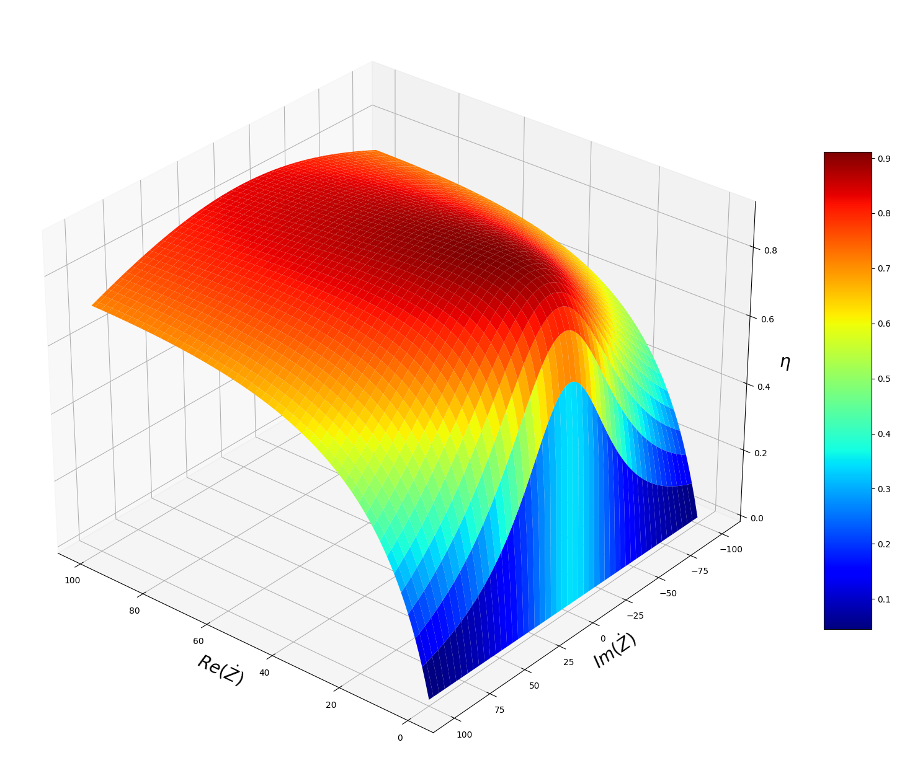

# Trasformatore reale

Dallo schema equivalente del trasformatore, noti $\dot e_1$ ed $\dot e_2$ (in relazione tra loro tramite il rapporto spire $m = {\dot e_1 \over \dot e_2} $), è facile ricavare:

$$
\dot I_2 ={\dot e_2 \over {R_2+jX_2+\dot Z}} \tag{1}
$$

$$
\dot V_2=\dot e_2 - (R_2+jX_2)\dot I_2 = \dot Z \dot I_2 \tag{2}
$$

$$
\dot I'_1 = {\dot I_2 \over m} \tag{3}
$$

$$
\dot I_0 = {\dot e_1 \over {R_0}}+{\dot e_1 \over jX_0} \tag{4}
$$

$$
\dot I_1 = \dot I_0 + \dot I'_1 \tag{5}
$$

$$
\dot V_1 = \dot e_1 + (R_1+ jX_1) \dot I_1 \tag{6}
$$

### Relazione tra le tensioni al primario e al secondario

Nel caso sia fornita $\dot V_1$ e venga richiesto di ricavare $\dot V_2$ risulta necessario combinare le formule sopraesposte:

Dalla (6) con alcune sostituzioni si ricava:

$$
\begin{aligned}
    & \dot V_1 = \dot e_1 + (R_1+jX_1) \Big[ \dot e_1 ({1 \over {R_0}}+{1 \over jX_0})+{\dot I_2 \over m} \Big ] = \\
    & =\dot e_1 + \dot e_1 (R_1+jX_1) ({1 \over {R_0}}+{1 \over jX_0})+(R_1+jX_1){\dot I_2 \over m} = \\
    & =\dot e_1 \Big [1+(R_1+jX_1) ({1 \over {R_0}}+{1 \over jX_0}) \Big ]+{(R_1+jX_1) \over m}\dot I_2
\end{aligned}
$$

posti:

$$
\begin{aligned}
& \dot A = 1+(R_1+jX_1) ({1 \over {R_0}}+{1 \over jX_0}) \\
& \dot B = {(R_1+jX_1) \over m}
\end{aligned}
$$

Si può riscrivere:

$$
\dot V_1 = \dot A \dot e_1+\dot B \dot I_2
$$

e ricavare $\dot e_1$:

$$
\dot e_1 = {1 \over \dot A}(\dot V_1-\dot B \dot I_2) \tag{7}
$$

Da questa ricavare $\dot e_2$:

$$
\dot e_2 = {1 \over {m \dot A}}(\dot V_1-\dot B \dot I_2)
$$

che sostituita nella (1) porta a scrivere:

$$
\dot I_2 = {1 \over {R_2+jX_2+\dot Z}} \cdot {1 \over {m \dot A}}(\dot V_1-\dot B \dot I_2)
$$

Posto:

$$
\dot C = {1 \over {R_2+jX_2+\dot Z}} \cdot {1 \over {m \dot A}}
$$

diventa:

$$
\dot I_2 = \dot C(\dot V_1-\dot B \dot I_2)
$$

dalla quale si ricava:

$$
\dot I_2 = {\dot C \over {1+\dot B \dot C}} \dot V_1 \tag{8}
$$

che sostituita nella (2) permette di ottenere:

$$
\dot V_2 = {\dot Z \dot C \over {1+\dot B \dot C}} \dot V_1 \tag{9}
$$

Nella figura seguente ([codice Python](Grafico_tensione_secondario.py)) un esempio del valore della tensione al secondario $|\dot V_2|$ al variare del carico applicato.

### Rendimento

Si calcola con il rapporto tra la potenza attiva del secondario e quella del primario:

$$
\eta = {P_2 \over P_1} = {Re(\dot V_2 \underline {\dot I_2}) \over Re(\dot V_1 \underline {\dot I_1})}
$$

dove:

- i termini sottolineati vanno intesi come complessi coniugati;

- con il simbolo $Re$ si intende l'operatore che estrae la parte reale del numero complesso.

Il valore di $\dot V_1$ è noto. $\dot V_2$ ed $\dot I_2$ si calcolano con le (8) e (9). Sostituendo la (7) nella (4) e quest'ultima assieme alla (3) nella (5) si ottiene:

$$
\dot I_1 = {1 \over \dot A}(\dot V_1-\dot B \dot I_2)({1 \over {R_0}}+{1 \over jX_0})+{\dot I_2 \over m}
$$

Nella figura seguente ([codice Python](Grafico_rendimento.py)) un esempio del valore del rendimento al variare del carico applicato.

